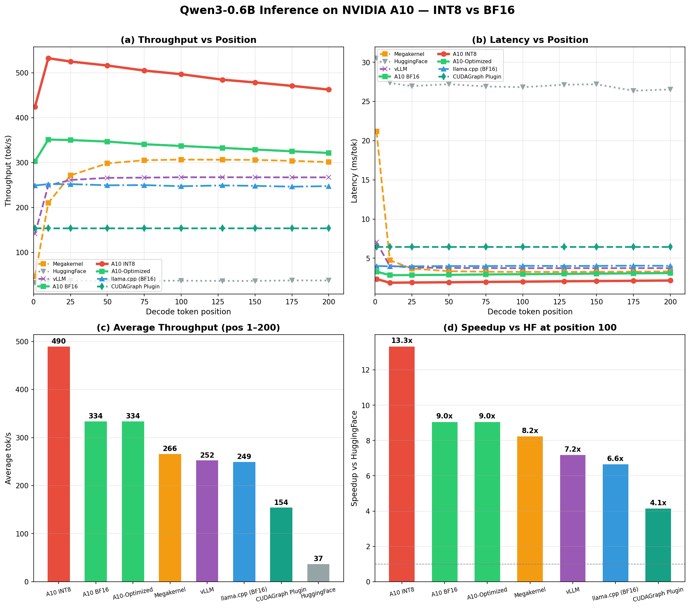

# MegaQwen-A10

**NVIDIA A10 优化 Qwen3-0.6B 纯 CUDA 融合解码内核 — 支持 BF16 & INT8**

基于 A10 (sm_86, 72 SMs, 24GB) 的手写 CUDA 推理内核，cooperative groups 单波次 decode + 全 INT8 权重量化。

---

## 性能

### 总体对比

| 方案 | 精度 | 吞吐量 (tok/s) | vs BF16 |
|------|------|----------------|---------|
| **MegaQwen-A10 INT8** | INT8 | **~490** | **1.47x** |
| **MegaQwen-A10 BF16** | BF16 | **~340** | 1.00x |
| MegaQwen v4 基线 (3090→A10) | BF16 | ~199 | — |
| llama.cpp BF16 | BF16 | ~249 | — |
| llama.cpp Q4_K_M | Q4_K_M | ~438 | — |
| vLLM (Eager) | BF16 | ~158 | — |
| HuggingFace | BF16 | ~37 | — |

### 位置相关吞吐量



| Token Position | INT8 (tok/s) | BF16 (tok/s) | Speedup |
|:---:|:---:|:---:|:---:|
| 1 | 425 | 303 | 1.40x |
| 25 | 525 | 350 | 1.50x |
| 50 | 516 | 347 | 1.49x |
| 100 | 497 | 337 | 1.47x |
| 200 | 463 | 322 | 1.44x |

---

## INT8 量化方案

### 量化策略

- **Per-ouput-channel symmetric quantization**: `scale[j] = absmax(W[j,:]) / 127`
- **量化范围**: 全部线性投影层 (Q / K / V / O / Gate / Up / Down) + LM Head
- **保持 BF16**: Embedding、RMSNorm、RoPE tables、KV cache
- **Int8 GEMM 展开**: 每 `uint4` (128-bit) load 处理 16 个 int8 权重 × 16 个 float 激活值

### 内存带宽节省

| | BF16 | INT8 | 节省 |
|------|------|------|------|
| 每 step 内存读取 | ~1192 MB | ~595 MB | **50%** |
| 全权重存储 | ~1.2 GB | ~0.6 GB | **50%** |

---

## 架构

```
输入 token → Embed → [ ×28 层 ] → Final RMSNorm → LM Head → 输出 token
                           │
                ┌──────────┼──────────┐
                ↓          ↓          ↓
         RMSNorm → QKV → RoPE+Cache → Attention → O Proj → PostNorm → MLP → Down Proj
```

**单波次设计**: 72 个 block 精确匹配 A10 的 72 个 SM，每 SM 一个 block，cooperative groups 同步。

## 内核流水线（每层）

| 阶段 | 函数 | 参与的 block | 同步点 |
|------|------|-------------|--------|
| 1 | `rmsnorm_qkv` | block 0 RMSNorm → 全部 72 QKV 投影 | 2 个 barrier |
| 2 | `qk_norm_rope_cache` | 全部 72 (分布式 Q/K heads + KV cache 写) | 1 个 barrier |
| 3 | `attention` | block 0-15 做注意力; 16-71 L2 权重预取 | 1 个 barrier |
| 4 | `o_proj_postnorm_mlp` | 全部 72 (O投影 + PostNorm + Gate/Up + Down) | 4 个 barrier |

28 层 × 5 barrier + embed(1) + final = 141 个 `grid.sync()` 调用。

## 优化技术

1. **全 INT8 权重量化** — 全部线性层使用 int8 权重 + per-channel float scale；matvec 内联反量化，无额外 kernel launch
2. **72 块单波次发射** — `NUM_BLOCKS=72` 精确匹配 A10 的 72 SM
3. **Cooperative Groups 同步** — `cg::this_grid()` + `grid.sync()` 跨 block 同步
4. **uint4/float4 向量化** — 128-bit 加载: int8 版本每 load 处理 16 个 int8 × 16 个 float 激活；BF16 版本每 load 8 个 bf16 × 8 个 float
5. **共享内存激活缓存** — MLP gate+up 从 `s_act` 读取，避免重复全局加载
6. **权重预取** — 空闲 block (16-71) 在 attention 阶段预取下一层权重到 L2
7. **RMSNorm + QKV 融合** — block 0 做 RMSNorm → 全部 block 做 QKV 投影，节省 1 个 barrier
8. **O投影 + PostNorm + MLP 流水线** — 三阶段融合在单函数内，共享同步点
9. **`--use_fast_math`** — 浮点融合优化

---

## 关键文件

| 文件 | 说明 |
|------|------|
| `a10_decode_kernel.cu` | **BF16 融合解码内核**（生产版本） |
| `a10_int8_decode_kernel.cu` | **INT8 融合解码内核**（全部线性层 int8 量化） |
| `config.cuh` | 配置常量 / `LayerWeights` / `ScalePointers` 结构体 |
| `a10_decode.py` | BF16 解码器类 + benchmark |
| `bench_int8.py` | INT8 权重量化 + 编译 + benchmark（含 C++ wrapper） |
| `int8_decoder.py` | Triton-based INT8 GEMV 微基准（学术参考） |
| `gen_int8_kernel.py` | BF16 → INT8 内核源码转换工具 |
| `build_int8_kernel.py` | INT8 内核构建流水线（备用方案） |
| `run_benchmark.py` | BF16 benchmark 启动器 |
| `run_int8_bench.py` | INT8 独立 benchmark 启动器 |
| `bench_and_plot_int8.py` | INT8+BF16 全位置 benchmark + 曲线图绘制 |
| `benchmark_positions.py` | 位置相关 benchmark |
| `verify_correctness_a10.py` | 正确性验证（vs HuggingFace） |
| `demo.py` | 快速演示脚本 |
| `a10_chat.py` | 交互式对话 |
| `attention.cuh` / `matvec.cuh` / `rmsnorm.cuh` / `rope.cuh` | 参考实现 |
| `minimal_test.py` / `minimal_test2.py` | Barrier 确定性测试 |

---

## 运行

```bash
# INT8 benchmark（全量化）
python bench_and_plot_int8.py

# BF16 benchmark
python a10_decode.py

# 单次正确性验证
python verify_correctness_a10.py
```

**依赖**：
- CUDA 12.8+
- PyTorch 2.10.0+ (cu128)
- transformers
- NVIDIA A10 (sm_86) 或兼容 GPU

**模型路径**：默认 `/mnt/workspace/DSW-GPU/MegaQwen/Qwen3-0.6B`（需预先下载 HuggingFace Qwen3-0.6B 权重）

---

## INT8 正确性

| 指标 | 结果 |
|------|------|
| 单 matvec 相对误差 | ~0.8–1.5% |
| 单 matvec cos_sim | > 0.99986 |
| BF16 vs INT8 首个 token 匹配 | 100% (20/20) |
| 30 token 生成匹配率 | ~97% (量化误差累积) |

---

## Known Issues

- `cp.async` MLP 双缓冲在 sm_86 上导致非确定性，已禁用（使用直接 `__ldg`）
- 当前 attention 为纯 warp 归约，未使用 Tensor Core — **这是主要剩余瓶颈**
- INT8 attention 预取对 `o_w` 使用了 `int8_t*` 强制转换（仅用于 L2 缓存预热，不影响正确性）
